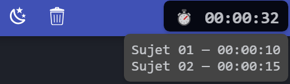

Bonjour, ce site regroupe tous les sujets d'épreuve pratique du BAC de NSI 2025.

---

Comment se servir du Chronomètre ?

(Bien que le chronomètre soit disponible sur tout le site, il n'est utile quand dans la section "Tous les sujets".)
 
1. Cliquer sur le bouton en haut à gauche "▶️ Chrono" ou appuyer sur la touche F4 du clavier :
 

 
2. Ensuite un chronometre apparait et le temps defile :
 

 
3. Quand un sujet est fini, cliquer sur la touche F4 du clavier et le temps par sujet apparait (à la validation dernier sujet le temps du chronomètre s'arrête) : 
 

---

Liste des problèmes bientôt corrigés :

-Tests publiques non / partiellement faits pour les exercices avec de l'aléatoire.
 
-Exercices avec des problèmes dans les tests repérés :
<ul>
    <li>sujet 26 exercice 2</li>
    <li>sujet 31 exercice 2</li>
    <li>sujet 35 exercice 2</li>
    <li>sujet 41 exercice 2</li>
</ul>
  

---

